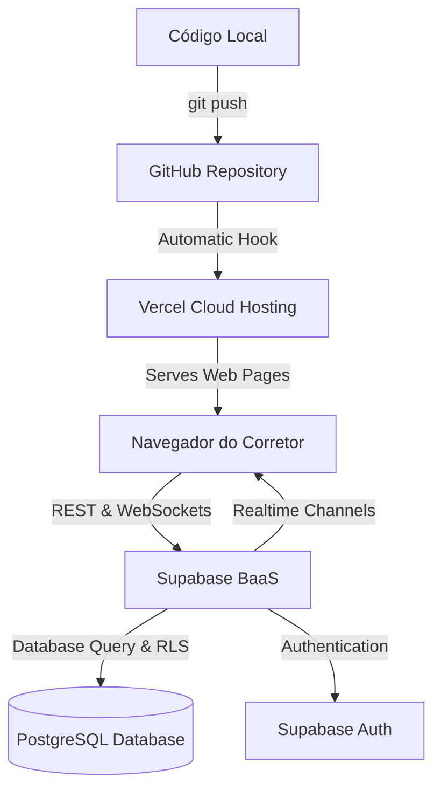
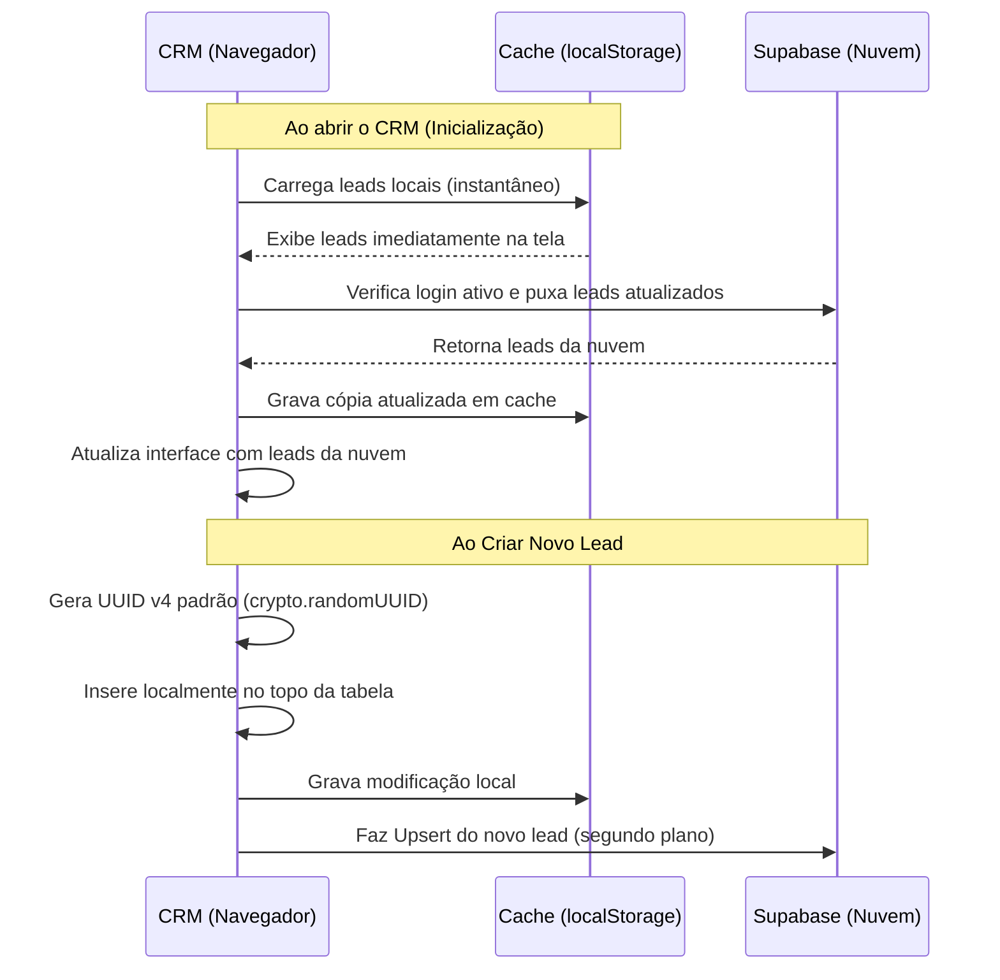

# 🏠 Manual de Arquitetura — CRM Loreny Imóveis v2
Este documento detalha o ecossistema tecnológico e o fluxo operacional do **CRM Loreny Imóveis v2**, descrevendo como o código do front-end se conecta ao **GitHub**, realiza deploy na **Vercel** e consome dados em tempo real no **Supabase** de maneira ultra-segura.

---

## 🛠️ 1. Pilhas Tecnológicas (Tech Stack)

O CRM foi projetado sob a filosofia de alta performance, leveza (*zero-dependency*) e experiência de usuário fluida.

*   **Estrutura**: HTML5 Semântico com foco em acessibilidade e legibilidade em múltiplos dispositivos.
*   **Estilização**: Vanilla CSS3 moderno. Utiliza variáveis CSS dinâmicas para gestão de cores e layouts responsivos flexíveis baseados em CSS Grid e Flexbox.
*   **Lógica**: JavaScript ES6+ puro (sem frameworks pesados). Todo o processamento ocorre no próprio navegador do corretor, o que garante carregamento em milissegundos.
*   **Persistência Local (Offline)**: Web Storage API (`localStorage`) para resposta instantânea ao usuário.
*   **Offline First / PWA**: Service Worker (`sw.js`) ativo com estratégia *Network First* para permitir o carregamento do CRM mesmo sem internet.

---

## ☁️ 2. Sinergia da Infraestrutura (GitHub + Vercel + Supabase)

O CRM Loreny Imóveis é uma aplicação servida diretamente na nuvem de forma automatizada e escalável. A infraestrutura baseia-se em três pilares principais:



### A. GitHub: O Coração do Código e Controle de Versão
O **GitHub** atua como o repositório central de código-fonte. Ele armazena o histórico completo do desenvolvimento e serve como a ponte para automações.
*   **Como funciona**: Sempre que uma alteração é finalizada e enviada para o GitHub (`git push`), ele registra a versão e avisa imediatamente à Vercel que há código novo pronto para ser disponibilizado.

### B. Vercel: Hospedagem de Alto Desempenho e Deploy Contínuo (CI/CD)
A **Vercel** hospeda o front-end estático da aplicação, distribuindo os arquivos HTML, CSS, JS e imagens por uma rede global ultra-rápida de servidores (CDN Edge).
*   **Deploy Automatizado**: Ao receber o sinal do GitHub, a Vercel compila e faz deploy automático da nova versão do CRM em segundos.
*   **SSL Automático**: Garante conexão segura HTTPS de ponta a ponta, requisito obrigatório para rodar recursos modernos de segurança (como a geração criptográfica de UUIDs e Service Workers).

### C. Supabase: O Banco de Dados e Serviços de Backend (BaaS)
O **Supabase** fornece a infraestrutura de backend em nuvem sem necessidade de servidores dedicados (Serverless BaaS), apoiando-se em tecnologias abertas e seguras:
1.  **PostgreSQL**: Banco de dados relacional de nível empresarial que armazena os leads, históricos e modelos de mensagens.
2.  **Supabase Auth**: Sistema completo de login integrado que permite aos corretores criar contas e fazer login com e-mail e senha de forma criptografada.
3.  **Row Level Security (RLS)**: Mecanismo de segurança ativo que garante que **cada corretor visualize e modifique única e exclusivamente os seus próprios leads**, isolando os dados de forma multi-tenant.
4.  **Realtime WebSockets**: Um canal de comunicação bidirecional aberto em tempo real. Se um corretor atualizar um lead em uma aba, a alteração se reflete instantaneamente em outro dispositivo conectado à mesma conta sem precisar recarregar a tela.

---

## 🔒 3. Arquitetura de Segurança e Banco de Dados (Supabase)

### Estrutura das Tabelas (Schema)

O banco de dados do Supabase é composto por duas tabelas principais configuradas especificamente para o CRM:

#### Tabela `public.leads`
Armazena a carteira de clientes, o status no funil de vendas e o histórico completo de interações:
*   `id` (`TEXT` ou `UUID`, Primary Key): Identificador único universal (UUID v4) gerado no front-end.
*   `user_id` (`UUID`, Foreign Key): Referência ao usuário proprietário no Supabase Auth.
*   `nome` (`TEXT`, Not Null): Nome completo do lead.
*   `whatsapp` (`TEXT`): Telefone/WhatsApp formatado.
*   `origem` / `tipo` / `regiao` / `valor` (`TEXT`): Dados de qualificação do imóvel buscado.
*   `status` (`TEXT`): Coluna do funil de vendas (ex: "Novo lead", "Proposta feita").
*   `proxima_acao` (`TEXT`) / `data_retorno` (`TEXT`): Ações de follow-up do corretor.
*   `observacoes` (`TEXT`): Detalhes livres e anotações.
*   `criado_em` (`TIMESTAMPTZ`): Data e hora de criação automática UTC.
*   `historico` (`JSONB`): Array estruturado contendo logs detalhados das interações.

#### Tabela `public.wa_templates`
Armazena os modelos de mensagens rápidas do WhatsApp personalizados por corretor:
*   `id` (`TEXT`, Primary Key): Identificador do modelo.
*   `user_id` (`UUID`): ID do corretor proprietário.
*   `title` (`TEXT`): Título do modelo (ex: "Apresentação").
*   `description` (`TEXT`): Breve descrição do modelo.
*   `text_content` (`TEXT`): Texto contendo variáveis dinâmicas `{nome}`, `{tipo}`, etc.
*   `criado_em` (`TIMESTAMPTZ`): Timestamp de criação.

---

### Row Level Security (RLS): Segurança Absoluta

O CRM possui segurança a nível de linha (RLS) habilitada no banco. Isso significa que mesmo se alguém conseguir a chave pública da sua API, o Supabase impedirá qualquer acesso não autorizado. As regras são claras:

```sql
-- Garante que o corretor logado só consiga VER os seus próprios registros
CREATE POLICY "Corretores podem ver apenas seus próprios leads" 
ON public.leads FOR SELECT TO authenticated USING (auth.uid() = user_id);

-- Garante que o corretor só consiga INSERIR registros apontando para seu próprio user_id
CREATE POLICY "Corretores podem criar seus próprios leads" 
ON public.leads FOR INSERT TO authenticated WITH CHECK (auth.uid() = user_id);

-- Garante que o corretor só consiga ATUALIZAR seus próprios registros
CREATE POLICY "Corretores podem atualizar seus próprios leads" 
ON public.leads FOR UPDATE TO authenticated USING (auth.uid() = user_id) WITH CHECK (auth.uid() = user_id);

-- Garante que o corretor só consiga EXCLUIR seus próprios registros
CREATE POLICY "Corretores podem excluir seus próprios leads" 
ON public.leads FOR DELETE TO authenticated USING (auth.uid() = user_id);
```

---

## ⚡ 4. Lógica da Aplicação Front-end (`app.js`)

A lógica foi arquitetada para ser **Local-First com sincronização defensiva**.



### Destaques das Funções de Lógica Implementadas

1.  **UUID v4 Robusto (`uid`)**:
    Gera chaves únicas baseadas no gerador de números aleatórios criptográficos do sistema (`crypto.randomUUID`), garantindo que não existam colisões de identificadores no banco de dados e que a exclusão funcione sempre sem falhar por incompatibilidade de tipo.
2.  **Sincronização Unidirecional Inteligente (`saveLeads`)**:
    Evita tráfego desnecessário e sobrecarga na nuvem. Ações como adicionar uma mensagem rápida salvam apenas o lead afetado (`saveLeads(lead)` em vez de todos), otimizando o tráfego da rede.
3.  **Filtro Antiloop do Realtime (`setupRealtime`)**:
    O ouvinte do Supabase Realtime compara recursivamente os dados que chegam do banco com o estado local. Se forem idênticos (por exemplo, a confirmação do próprio salvamento local do corretor), o sistema ignora silenciosamente, evitando re-renderizações, tremores de tela e consumo inútil de banda.
