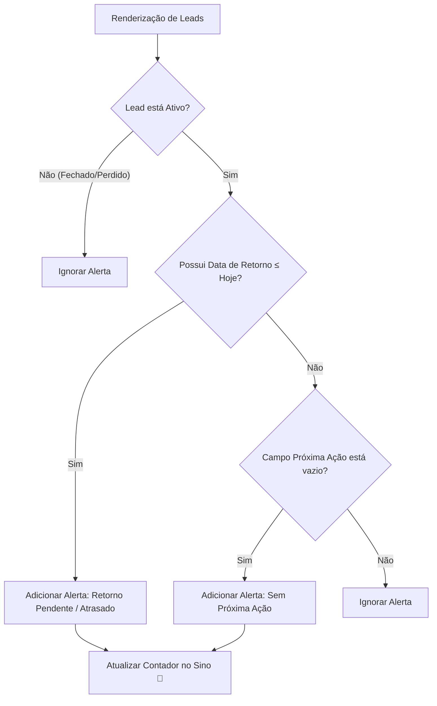

# 📋 Dossiê Detalhado — CRM Loreny Imóveis 🏠✨

Este dossiê técnico e de negócios consolida todas as informações sobre a concepção, arquitetura, design visual, migração de dados e integração na nuvem do **CRM Loreny Imóveis**. Este sistema foi desenvolvido sob medida para a corretora de imóveis autônoma Loreny, visando maximizar a produtividade comercial e garantir o acompanhamento rigoroso de leads no mercado imobiliário.

---

## 📖 1. Visão Geral e Filosofia de Design

O **CRM Loreny Imóveis** é uma aplicação web de página única (SPA), de alto desempenho e totalmente responsiva. Ele foi construído com tecnologias web puras e nativas (HTML5, CSS3 e JavaScript Vanilla), garantindo carregamento instantâneo, compatibilidade com qualquer navegador moderno e independência de frameworks pesados ou servidores complexos.

### 🎨 Estética e Experiência do Usuário (UX/UI)
* **Aparência Premium (Dark Glassmorphism)**: O design utiliza uma paleta de cores escura e sofisticada, inspirada nas principais ferramentas modernas de produtividade SaaS. Elementos de transparência vítrea baseados em CSS (`backdrop-filter`) criam uma sensação de profundidade e elegância de alto padrão.
* **Micro-animações**: Hover dinâmicos, transições suaves e animações de entrada (`fadeInUp`) tornam o uso fluido e agradável.
* **Layout Responsivo e Adaptável**: A interface foi planejada para funcionar perfeitamente em telas grandes (notebooks e desktops), tablets e dispositivos móveis (por meio de cards compactos otimizados para toque vertical).
* **Usabilidade da Tabela de Dados**: Para evitar o esmagamento de informações em notebooks e tablets, o contêiner da tabela possui rolagem horizontal suave com largura mínima garantida de `1100px` e barra de rolagem customizada e facilitada de `8px`.

---

## 🗂️ 2. Estrutura Física do Projeto

A aplicação é autossuficiente e estruturada em apenas três arquivos principais no diretório raiz:

```
lorenyCRM/
├── index.html        # Estrutura semântica e esqueleto das telas/modais
├── style.css         # Identidade visual premium, Dark Mode e responsividade
└── app.js            # Lógica comercial, motores de filtro, alertas e sync híbrida
```

### Detalhamento dos Arquivos:
1. **`index.html`**:
   * Contém a marca da empresa e o cabeçalho de ações com a Central de Alertas integrada.
   * Dashboard composto por 6 cards de estatísticas interativas.
   * Painel de filtros avançados por texto, status, origem, tipo de imóvel, retornos diários e pendências.
   * Controles de alternância de exibição de abas (Tabela de leads ↔ Kanban).
   * Modais integrados para:
     * Cadastro/Edição de Leads.
     * Histórico detalhado de interações com formulário rápido.
     * Confirmação segura de remoção permanente.
     * Configuração dinâmica de chaves de nuvem (Supabase).
     * Modal duplo para o WhatsApp (Envio rápido ↔ Painel de personalização).
2. **`style.css`**:
   * Arquitetado com variáveis CSS nativas (`:root`) facilitando a manutenção e padronização das cores institucionais (ouro/bronze imobiliário, tons escuros de fundo, verde de sucesso e vermelho de alerta).
   * Definição de estilos para os cards do Kanban, badges coloridas dos status comerciais, animações de pulso na notificação do sino e o menu flutuante (.alerts-dropdown) estilo glassmorphism.
3. **`app.js`**:
   * Concentra a totalidade da lógica em JavaScript puro e assíncrono.
   * Contém a configuração de cores e identificadores de status (`STATUS_CONFIG`).
   * Configuração de modelos originais nativos (`WA_TEMPLATES_DEFAULTS`).
   * Motor de pesquisa inteligente com *debounce* de `220ms` (reduz chamadas excessivas e melhora o desempenho ao digitar na busca).
   * Lógica do fluxo Drag & Drop no painel Kanban.

---

## 🔔 3. Central de Alertas e Pendências (Alert Hub)

A corretora de imóveis autônoma precisa saber exatamente **quem chamar** e **quando chamar**. A Central de Alertas monitora o pipeline de forma ativa a cada renderização da tela:



### Funcionalidades do Alert Hub:
* **Filtros de Segurança**: Ignora automaticamente leads nos status `Fechado` ou `Perdido` para focar estritamente na produtividade do pipeline ativo de negociações.
* **Retornos Atrasados**: Dispara alertas caso a `Data de Retorno` seja igual ao dia de hoje (tag `Hoje 📅` em amarelo) ou inferior à data atual (tag `Atrasado ⚠️` em vermelho).
* **Leads no Limbo**: Sinaliza com a tag `Definir Ação ✏️` em laranja qualquer lead que esteja ativo mas que não possua o campo `Próxima Ação` preenchido.
* **Navegação Clicável**: Ao clicar em qualquer pendência na lista do sino, o dropdown flutuante fecha automaticamente e abre o modal de edição do lead em questão, permitindo sanar a pendência no mesmo instante.

---

## ✨ 4. Mensagens Rápidas do WhatsApp (Quick Replies)

Desenvolvemos uma ferramenta interna de produtividade que gera mensagens altamente personalizadas com um único clique, interpolando as variáveis reais da ficha do lead.

### Substituição Dinâmica de Placeholders:
* **`{nome}`**: Extrai dinamicamente apenas o primeiro nome do cliente (ex: *"Carlos da Silva"* vira *"Carlos"*). Se vazio, aplica *"Cliente"*.
* **`{tipo}`**: Converte o tipo de imóvel para caixa baixa para fluidez na leitura (ex: *"Apartamento"* vira *"apartamento"*). Se vazio, aplica *"imóvel"* ou *"imóveis"* de acordo com o contexto do modelo.
* **`{regiao}`**: Substitui pelo bairro ou região desejada. Se vazio, insere *"excelente região"*.
* **`{valor}`**: Insere a faixa de valor. Se vazio, insere *"sua faixa de interesse"*.

### CRUD Híbrido de Modelos ⚙️:
Ao clicar em **`⚙️ Personalizar Modelos`**, a corretora acessa uma tela de gerenciamento de templates:
* **Inserção Dinâmica**: Botões rápidos clicáveis abaixo do formulário inserem `{nome}`, `{tipo}`, `{regiao}` ou `{valor}` diretamente na posição exata em que o cursor de digitação está posicionado no editor de texto.
* **Restaurar Padrões**: Um botão especial permite limpar todas as customizações locais e da nuvem e restaurar instantaneamente os 4 modelos originais premium.

---

## ☁️ 5. Integração com a Nuvem e Arquitetura Híbrida (Supabase)

O CRM opera em um modelo híbrido (**Offline-first com sincronização na nuvem**). Caso a corretora esteja sem internet, os dados são lidos/salvos no `localStorage` do navegador. Assim que a rede se restabelece ou o Supabase é conectado, os dados são sincronizados perfeitamente na nuvem.

### Estrutura do Banco de Dados no Supabase (SQL DDL)

Para ativar a sincronização na nuvem, a base de dados do Supabase é configurada com duas tabelas principais com Row Level Security (RLS) e acesso público sob a chave anônima padrão:

```sql
-- 1. Tabela de Leads e Clientes
create table leads (
  id text primary key,
  nome text not null,
  whatsapp text,
  origem text,
  tipo text,
  regiao text,
  valor text,
  status text,
  proxima_acao text,
  data_retorno text,
  observacoes text,
  criado_em timestamp with time zone default timezone('utc'::text, now()) not null,
  historico jsonb default '[]'::jsonb
);

-- 2. Tabela de Modelos de Mensagens (WhatsApp Quick Replies)
create table wa_templates (
  id text primary key,
  title text not null,
  description text,
  text_content text not null,
  criado_em timestamp with time zone default timezone('utc'::text, now()) not null
);

-- Ativar segurança em ambas as tabelas (RLS)
alter table leads enable row level security;
alter table wa_templates enable row level security;

-- Criar políticas de acesso público com chave anônima (leitura/escrita total pública)
create policy "Acesso público com chave anon" on leads for all using (true) with check (true);
create policy "Acesso público com chave anon" on wa_templates for all using (true) with check (true);
```

### Lógica de Sincronização em JavaScript (`app.js`):
* **`loadWaTemplates()`**: Busca registros do banco `wa_templates` ordenados pela data de criação. Caso o banco esteja vazio na primeira conexão, o sistema migra de forma inteligente os modelos que o usuário já havia customizado localmente em vez de apagá-los com as mensagens de fábrica.
* **`saveWaTemplatesToStorage()`**: Salva em plano de fundo no `localStorage` como backup físico offline e paralelamente dispara uma instrução `upsert` (insere ou atualiza registros baseando-se no ID fixado) no Supabase.
* **`deleteWaTemplate(idx)`**: Identifica o ID único do template deletado localmente e efetua uma requisição de delete síncrona/assíncrona no banco remoto Supabase para espelhar a exclusão globalmente.
* **Reatividade da Interface**: Funções como `testAndSaveSupabase()` e `disconnectSupabase()` recarregam os modelos em segundo plano de forma instantânea, permitindo ver os resultados de conexão e desconexão imediatamente na tela, sem recarregar a aba ou perder o progresso do trabalho.

---

## 📈 6. Conversão e Higienização de Dados (Excel ➜ CRM)

A corretora possuía uma planilha original com 133 registros denominada `CARTEIRA DE CLIENTES.xlsx`. Os dados foram higienizados e unificados utilizando um script personalizado em Python (`converter_carteira.py`):

1. **Fusão de Abas**: Consolidou leads espalhados entre abas como *"Rural"*, *"Gustavo"*, *"Rose"*, *"Formigoni"*, *"Marcio"* e *"Juniaglas"*.
2. **Higienização Telefônica**: Removeu parênteses, traços e espaços, prefixando com `55` (Código do Brasil) e adicionando o nono dígito quando ausente, gerando números válidos para disparo via API do WhatsApp.
3. **Padronização de Status**: Mapeou anotações textuais dispersas para o pipeline oficial de 10 etapas do CRM.
4. **Resgate de Históricos**: Converteu linhas duplicadas e anotações antigas em entradas estruturadas dentro do array JSON de histórico do lead correspondente.
5. **Formato Portável**: Gerou o arquivo `carteira_clientes_limpa.csv` no padrão UTF-8 com BOM, que pode ser importado diretamente na tela do CRM usando o botão **`↓ Importar CSV`**.

---

## 🛠️ 7. Guia de Instalação e Testes

### Como rodar em modo Local (Offline-first)
1. Certifique-se de que os arquivos `index.html`, `style.css` e `app.js` estão na mesma pasta.
2. Dê um clique duplo em `index.html`. O sistema iniciará imediatamente com dados demonstrativos em modo offline.

### Como rodar em Produção Compartilhada (GitHub ➜ Vercel ➜ Supabase)
1. **Repositório**: Suba os três arquivos principais para um repositório no seu GitHub.
2. **Hospedagem**: Conecte o repositório à sua conta Vercel. Cada commit no GitHub gerará um deploy de produção automático no link da Vercel.
3. **Banco de Dados**: Acesse seu console do Supabase e rode o código SQL apresentado no **Capítulo 5** no menu **SQL Editor**.
4. **Sincronização**: Abra o link da Vercel no navegador, clique no botão **`☁️ Nuvem`**, digite sua Supabase URL e Anon Key e clique em **Conectar**.
5. **Migração em Lote**: Se você tiver leads armazenados localmente e quiser migrá-los para a nuvem de uma vez, um painel dourado aparecerá no modal de nuvem. Basta clicar em **`⚡ Enviar leads locais para a nuvem`**.

### Roteiro de Testes Recomendado:
1. Abra a versão em produção do CRM em dois computadores diferentes.
2. Conecte ambos nas configurações de nuvem.
3. No Computador A, altere o status de um lead no Kanban arrastando-o para uma nova coluna.
4. No Computador B, atualize a página e veja que a posição do lead foi atualizada instantaneamente.
5. Crie um modelo personalizado no menu de WhatsApp no Computador B. Ele ficará disponível imediatamente para uso no Computador A.

---
*Dossiê elaborado e salvo com sucesso no diretório do projeto. Atualizado em 21 de maio de 2026.*
