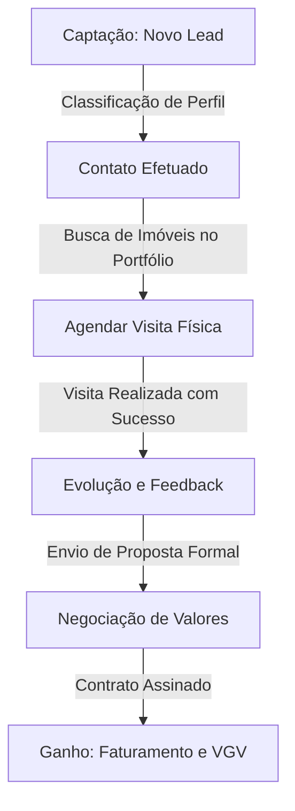

# Manual de Operação e Governança — CRM Loreny Imóveis v3

Este manual detalha a operação, o fluxo de trabalho imobiliário e os perfis de acesso (**Corretor** e **Gestor**) no **CRM Loreny Imóveis v3**, o sistema SaaS de alto padrão para gestão de leads, agendamento de visitas e controle de VGV (Valor Geral de Vendas).

---

## 👥 1. Perfis de Acesso & Governança (Roles)

O CRM Loreny Imóveis foi estruturado com base em permissões estritas para garantir privacidade, eficiência e governança imobiliária.

### 💼 A. Corretor de Imóveis (`broker` / autônomo)
O perfil do corretor é voltado para a **operação diária de vendas** e relacionamento com o cliente.
- **Isolamento de Carteira (RLS):** Cada corretor possui acesso estrito apenas aos seus próprios leads, visitas agendadas e modelos de mensagem do WhatsApp. A segurança ao nível de linha (RLS) do Supabase impede o vazamento de dados de clientes entre corretores concorrentes na mesma imobiliária.
- **Funções Principais:**
  - Cadastrar, editar e gerenciar seus leads imobiliários.
  - Acompanhar seu pipeline de negócios (do lead novo até o ganho/perdido).
  - Agendar visitas a propriedades físicas com clientes.
  - Criar e gerenciar seus modelos rápidos de mensagens de WhatsApp com injeção automática de tags.
  - Acompanhar suas métricas individuais de VGV Ativo e Comissão estimada de 5%.

### 👑 B. Gerente / Gestor de Vendas (`manager`)
O perfil do gestor é projetado para **liderança de equipe** e acompanhamento tático das metas da imobiliária.
- **Visão Macro:** Acesso unificado ao painel de desempenho dos corretores sob sua gestão.
- **Funções Principais:**
  - Visualizar o VGV total acumulado e a projeção agregada de receitas por região ou tipo de imóvel.
  - Identificar gargalos no funil de vendas (ex: muitos leads parados na etapa de "Visita Agendada" sem evolução para "Proposta").
  - Auditar o andamento dos agendamentos de visitas e taxas de conversão de leads individuais.
  - Dar suporte em negociações críticas de propostas de alto valor.

### 🛠️ C. Diretor / Administrador (`admin`)
Perfil com **acesso global** e controle total de configurações.
- **Funções Principais:**
  - Gerenciamento de acessos de novos corretores e aprovação de contas.
  - Edição do percentual padrão de comissão da imobiliária (padrão de 5.00%).
  - Manutenção técnica e integrações do banco Supabase e Vercel.

---

## 📊 2. Estrutura de Módulos & Recursos

O sistema é dividido em 4 abas sofisticadas de controle, projetadas com design *glassmorphic* premium baseado em Outfit e Inter.

### 🏠 A. Painel Geral (Dashboard)
A central de comando financeiro e rotina do usuário.
- **Leads Ativos:** Contagem em tempo real de contatos que não estão arquivados ou finalizados.
- **Próximas Visitas:** Contagem de visitas pendentes agendadas na agenda do corretor.
- **VGV Ativo (Valor Geral de Vendas):** Soma total dos orçamentos (`budget`) de todos os leads atualmente sob negociação ativa no funil.
- **Previsão de Comissão:** Projeção financeira direta baseada na taxa padrão de **5%** sobre o VGV Ativo, permitindo ao corretor prever seus ganhos mensais.
- **Próximas Visitas (Hoje/Amanhã):** Cards ordenados cronologicamente mostrando detalhes do cliente, imóvel de interesse e horário.
- **Linha do Tempo de Interações:** Histórico recente de atividades de leads no sistema.

### 👥 B. Gestão de Leads & Funil de Negócios
O coração operacional do CRM, reformulado para telas móveis e sem a necessidade de arrastar para as laterais.
- **Funil Inteligente (Pipelines):** Cada lead progride através de estágios estruturados:
  1. `new` (Novo Lead) — Primeiro contato registrado.
  2. `contacted` (Contato Feito) — Perfil e orçamento alinhados.
  3. `visit_scheduled` (Visita Agendada) — Data marcada para apresentação física de imóvel.
  4. `visited` (Visita Realizada) — Imóvel apresentado e colhendo feedback.
  5. `proposal` (Proposta Enviada) — Proposta de compra/locação enviada ao proprietário.
  6. `won` (Contrato Assinado / Ganho) — Negócio fechado com sucesso!
  7. `lost` (Sem Interesse / Perdido) — Lead arquivado.
- **Campos Específicos do Mercado:**
  - **Tipo de Imóvel:** Apartamento, Casa, Terreno, Comercial, etc.
  - **Região/Bairro:** Localização exata onde o cliente deseja comprar.
  - **Orçamento (R$):** Valor limite estimado que o comprador possui disponível.
- **Acompanhamento de Retorno:** Agendamento de data de retorno e descrição da próxima ação a tomar para reaquecer o contato.

### 🗓️ C. Agenda de Visitas
Controle estrito de agendamento de vistorias e visitas a propriedades.
- **Fidelidade de Dados:** Cada visita é associada diretamente a um lead cadastrado no CRM.
- **Dados Técnicos:** Endereço do imóvel, data e hora da visita, e roteiro personalizado (ex: "Pegar as chaves com o porteiro", "Focar na área de lazer").
- **Status da Visita:**
  - **Agendada:** Visita confirmada para o futuro.
  - **Realizada:** Vistoria feita com sucesso (permite evoluir o lead de estágio).
  - **Cancelada:** Imprevisto técnico ou desistência (mantém histórico).

### 💬 D. Modelos de WhatsApp (Templates)
Aceleração de contatos de forma hiper-personalizada.
- **Centralização:** O corretor cria modelos padrões de mensagens comuns que ele digita no dia a dia.
- **Injeção de Tags Rápidas:** O editor do CRM possui uma barra de botões com as tags `{{nome}}`, `{{imovel}}`, `{{regiao}}`, `{{valor}}`, `{{corretor}}`, `{{data_visita}}` e `{{hora_visita}}`.
- **Compilador Dinâmico:** Ao selecionar o WhatsApp de um cliente, o CRM substitui essas tags pelo conteúdo do lead instantaneamente. O corretor pode editar a caixa de texto livremente caso queira incluir uma informação personalizada extra antes de enviar ao WhatsApp Web/App com 1 clique.

---

## 🛠️ 3. Workflow de Vendas — Passo a Passo

Para extrair a máxima conversão do CRM Loreny Imóveis, siga o fluxo de trabalho ideal recomendado abaixo:

1. **Entrada do Lead:** Registre o cliente imediatamente com o nome, orçamento máximo e região de preferência. O lead entra como `Novo Lead` (`new`).
2. **Conexão Rápida:** Use a aba "Modelos WhatsApp" para carregar a mensagem de **Primeiro Contato**. Envie em poucos segundos. Ao alinhar os detalhes, avance o lead para `Contato Feito` (`contacted`).
3. **Agendamento da Visita:**
   - Acesse a aba **Visitas** e clique em **Agendar Visita**.
   - Selecione o cliente e digite o endereço do imóvel ideal selecionado.
   - Envie a mensagem de **Confirmação de Visitação** pelo WhatsApp para reforçar o compromisso com o cliente.
   - O lead avança automaticamente para `Visita Agendada` (`visit_scheduled`).
4. **Fechamento do Negócio:**
   - Realizou a visita? Altere o status do agendamento para **Realizada** e o lead para `Visita Realizada` (`visited`).
   - Apresente a proposta. O lead progride para `Proposta Enviada` (`proposal`).
   - Assinou o contrato? Mude o status do lead para `Contrato Assinado` (`won`). O seu VGV Ativo e Comissão serão calculados e o negócio entra para o seu faturamento de sucesso!

---

## 💡 4. Boas Práticas Imobiliárias para a Equipe

> [!TIP]
> **1. Nunca deixe um Lead sem Próxima Ação:**
> Leads frios custam caro. Utilize sempre o recurso de **Acompanhamento de Retorno** dentro do cadastro do Lead. O CRM destacará em amarelo quando houver um retorno agendado para o dia atual!
>
> **2. Mantenha os Status de Visita Atualizados:**
> O gestor de vendas avalia o engajamento da equipe através da proporção de Visitas Realizadas vs. Agendadas. Atualizar o status imediatamente após sair da propriedade física garante a fidelidade dos dados da imobiliária.
>
> **3. Refine as Variáveis dos Templates:**
> Crie templates específicos para diferentes nichos de mercado (ex: "Investidores comerciais" ou "Primeiro imóvel familiar"). Isso economiza mais de 2 horas semanais de digitação repetitiva.
